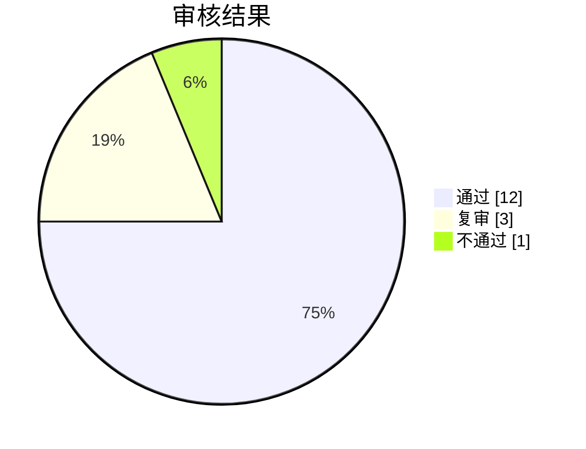

# UGCAudit

UGCAudit 是一个 Tauri 桌面端 UGC 审核链原型。

当前版本已经包含：

- 可视化审核流编辑
- 顺序连线和数据连线
- 图片集合、文本集合和内置数据提供节点
- 内置模块入口：PaddleOCR、ShieldGemma 2、Qwen3Guard
- 本地模型路径配置
- 流程保存和校验
- 一次审核运行记录
- 运行界面实时显示模块进度，并支持中断流程
- Markdown 报告生成和富文本预览
- 多审核方案文件保存和加载
- 同一个可执行文件支持无窗口 CLI 审核运行

当前版本不会自动下载任何模型。没有配置本地模型目录时，运行结果会显示“未配置模型”。

流程编辑器里，顺序线只控制步骤先后，数据线只控制模块拿到哪些图片或文本。默认流程会把“待测项目中所有图片”传给 OCR 和图片合规检测，再把 OCR 识别出的文本传给文本合规检测。

点击运行后会进入专门的运行界面，流程图变成只读。无依赖的模块会并行运行，当前默认最多同时运行 2 个模块。模块会通过进度文件实时上报进度，客户端会在节点上显示进度条，并在连线上显示流动的小圆点。点击中断时，客户端会先通知模块退出，模块 3 秒内没有响应时会被停止。

## 模块进度和中断

客户端启动模块时，会在输入 JSON 和环境变量里提供两个路径：

- `progressPath` / `UGCAUDIT_PROGRESS_FILE`：模块向这个文件追加 JSON 行。
- `cancelPath` / `UGCAUDIT_CANCEL_FILE`：客户端要求中断时会创建这个文件。

进度文件每行格式：

```json
{"progress":0.5,"message":"已处理 3/6","processed":3,"total":6}
```

模块应在长循环里定期检查 `cancelPath` 是否存在；存在时写出 `status: "cancelled"` 的结果并退出。旧模块如果不写进度仍然能运行，只是界面只能显示“运行中”和最终完成状态。

## 审核方案和 CLI

客户端可以把当前流程保存成 `.ugcaudit` 审核方案文件。方案文件只保存流程节点、连线和模块参数，不保存本次待审文件夹。

新建方案后直接点保存，会默认写入程序根目录下的 `Schemes` 文件夹。客户端顶部的方案列表会读取这个文件夹里的所有 `.ugcaudit` 文件，方便快速切换方案。另存为仍然可以保存到其他位置。

自动审核流水线可以直接调用同一个可执行文件：

```powershell
ugc-audit.exe run --scheme "D:\AuditSchemes\image.ugcaudit" --input "D:\UGCProject" --task-name "每日图片审核" --output "D:\AuditRuns\run-001"
```

退出码含义：

- `0`：审核通过。
- `2`：需要复审或不通过。
- `1`：参数、方案、路径或模块执行失败。

每次运行都会创建本次审核产物目录，报告和模块产物都会写到这里。传入 `--output` 时它就是本次产物目录；不传时使用客户端设置里的默认产物路径并自动创建 `任务名称-任务ID` 文件夹。产物目录内会生成 `run.json`、`report.md` 和 `cli-result.json`。运行 `npm run portable` 后，发布目录 `Publish\UGCAudit\App` 内会包含 `CLI使用说明.md`。

## 报告内容

模块返回的 `reportSection` 仍然是一段文本。报告页支持三类内容：

- Markdown：标题、列表、表格、任务列表、链接、图片、代码块等。
- 安全 HTML：可以混在 Markdown 里显示常见排版内容，脚本和危险行为会被过滤。
- Mermaid 图示：用 `mermaid` 代码块写流程图、饼图等图示。

示例：

````markdown
## 风险分布



<details>
  <summary>查看说明</summary>
  <p>这里可以放安全的 HTML 内容。</p>
</details>
````

## 开发

```powershell
npm install
npm run dev
```

## 构建

```powershell
npm run build
```

生成结果：

```text
Publish\UGCAudit\cargo-target\release\ugc-audit.exe
Publish\UGCAudit\web-dist
```

## 免安装包

```powershell
npm run portable
```

生成结果：

```text
Publish\UGCAudit\App
Publish\UGCAudit\UGCAudit-portable.zip
```
