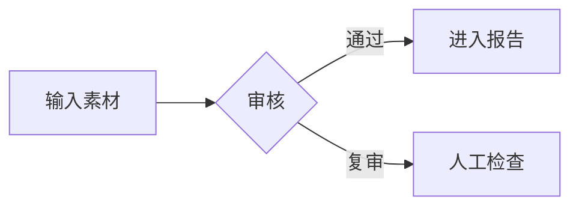
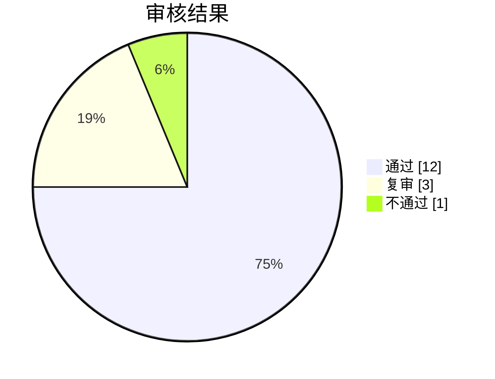
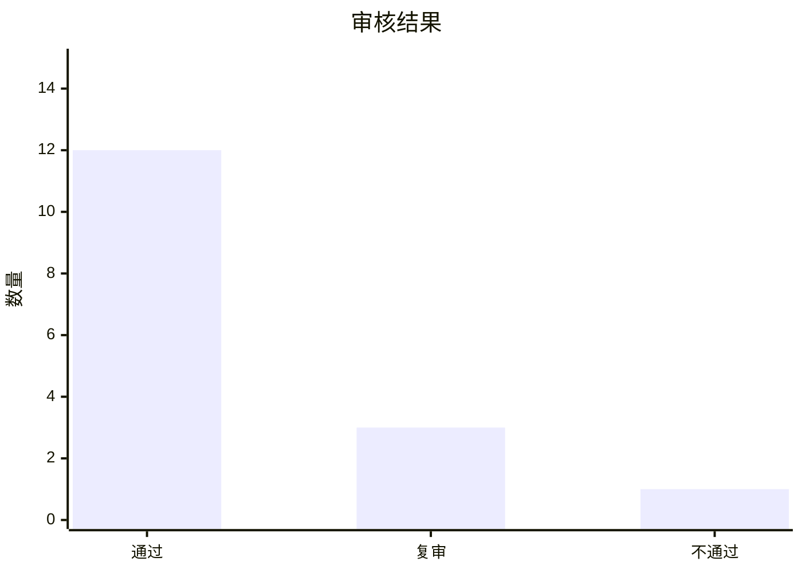
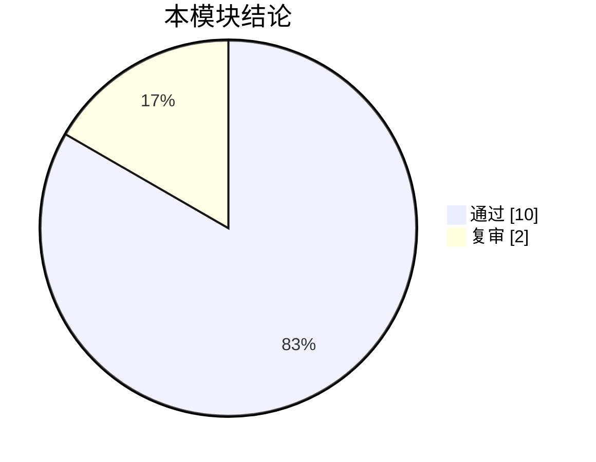
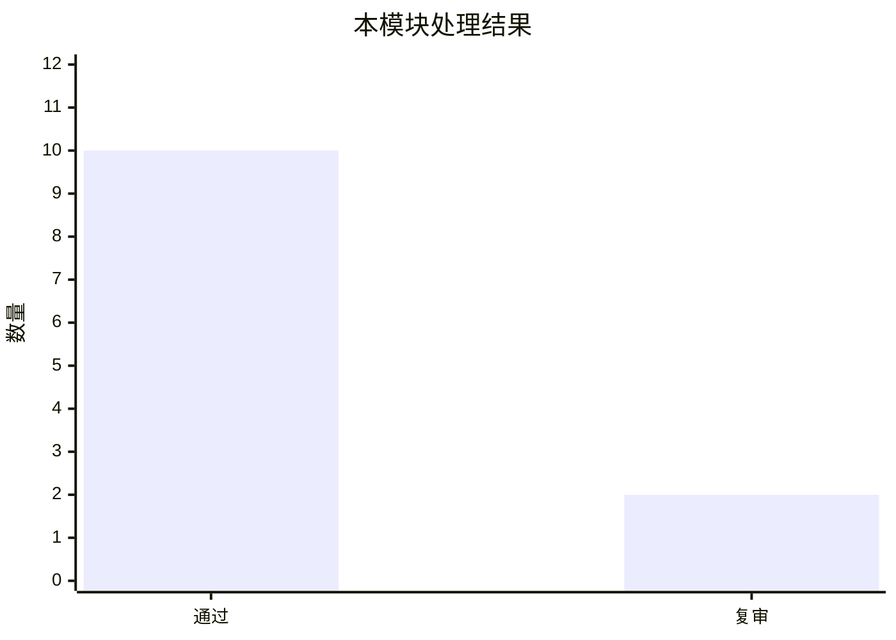

```mermaid
xychart-beta
  title "各模块命中数量"
  x-axis ["OCR", "图片检测", "文本检测"]
  y-axis "数量" 0 --> 10
  bar [2, 4, 6]
  bar [1, 3, 5]
```

# 客户端 Markdown 与 HTML 报告解析说明

本文档说明 UGCAudit 客户端报告页能够显示哪些内容，以及模块开发者应该如何编写 `reportSection`。

模块开发完整说明见 [模块开发文档总览](./模块开发文档总览.md)。如果只关心报告片段写法，继续阅读本文档。

## 适用范围

模块输出给客户端的报告内容仍然是一段字符串：

```json
{
  "reportSection": "### 图片文字识别\n\n识别到 12 行文字。"
}
```

客户端会把所有模块的 `reportSection` 汇总到最终报告中显示。模块开发者只需要写自己模块对应的报告片段，不要直接生成完整报告文件。

报告页目前支持三类内容：

- Markdown：用于普通报告正文。
- 安全 HTML：用于更灵活的排版。
- Mermaid 图示：用于流程图、饼图、柱状图等图形内容。

## Markdown 写法

### 标题

```markdown
### 图片文字识别

#### 识别明细
```

建议模块内部从三级标题开始写，因为最终报告外层已经有总标题和章节标题。

### 段落

```markdown
本轮共处理 12 张图片，其中 2 张需要人工复审。

主要风险来自图片中的文字内容。
```

段落之间留一个空行。

### 强调、删除线和行内代码

```markdown
最终结论：**需要人工复审**

命中风险：*疑似联系方式*

已废弃规则：~~旧版敏感词规则~~

模型版本：`qwen3guard-local`
```

### 列表

```markdown
- 已完成 OCR 识别
- 已完成文本风险检测
- 有 2 条内容需要复审
```

也可以写有序列表：

```markdown
1. 先检查图片文字
2. 再检查文字风险
3. 最后汇总结论
```

### 任务列表

```markdown
- [x] 已检查图片文字
- [x] 已检查文本风险
- [ ] 待人工复审
```

任务列表会显示为勾选框。

### 表格

```markdown
| 类型 | 数量 | 说明 |
| --- | ---: | --- |
| 通过 | 12 | 未发现明显风险 |
| 复审 | 3 | 需要人工确认 |
| 不通过 | 1 | 命中高风险规则 |
```

写表格时注意：

- 第二行必须是分隔行，比如 `| --- | --- |`。
- `---:` 表示数字靠右显示。
- 单元格里尽量不要直接写换行。

### 引用

```markdown
> 这段内容来自模型输出摘要，仅作为审核辅助信息。
```

### 分割线

```markdown
---
```

### 链接

```markdown
[查看审核规范](https://example.com/audit-policy)
```

链接会在新窗口打开。不要写 `javascript:` 这类链接，客户端会过滤掉。

如果报告里的文件名或路径需要点击后在系统文件夹里定位到目标文件，可以使用客户端专用链接：

```markdown
[image_001.png](ugcaudit://reveal?path=D%3A%5CUGC%5Cimages%5Cimage_001.png)
```

写法说明：

- `path=` 后面填写 URL 编码后的本地绝对路径。
- 本地文件超链接必须使用绝对路径，例如 `D:\UGC\images\image_001.png`。相对路径只作为旧报告兼容，不建议新模块继续使用。
- 点击后客户端会打开目标所在文件夹，并选中文件。
- 如果目标是文件夹，会直接打开该文件夹。
- 浏览器预览模式不能定位本地文件，桌面客户端中才会生效。

### 图片

```markdown


```

图片支持：

- Windows 绝对路径，例如 `D:/folder/image.png`。
- 网络路径，例如 `https://example.com/image.png`。
- `data:`、`asset:`、`file:`、`blob:` 图片地址。

注意：

- 新模块输出的本地图片必须使用绝对路径。相对路径只为旧报告保留兼容能力，后续不要再依赖。
- 图片地址为空或是 `javascript:` 时不会显示。
- 本地图片路径在桌面客户端里会自动转成可显示地址。
- 图片会限制在报告区域内，不会撑破页面。

### 代码块

普通代码块会按代码显示：

````markdown
```json
{
  "verdict": "review",
  "matchedFiles": 2
}
```
````

## 安全 HTML 写法

Markdown 中可以混写 HTML，用于更灵活的展示。

### 折叠说明

```html
<details open>
  <summary>查看详细原因</summary>
  <p>图片中识别到疑似联系方式，需要人工复审。</p>
</details>
```

### 简单布局

```html
<div style="border: 1px solid #d8ddd5; padding: 8px;">
  <strong>风险提示：</strong>
  <span style="color: #9a3e2d;">命中高风险文本</span>
</div>
```

### HTML 表格

```html
<table>
  <thead>
    <tr>
      <th>字段</th>
      <th>值</th>
    </tr>
  </thead>
  <tbody>
    <tr>
      <td>风险等级</td>
      <td>复审</td>
    </tr>
  </tbody>
</table>
```

### 常用可显示标签

报告页允许常见展示标签，例如：

- 标题和正文：`h1` 到 `h6`、`p`、`br`、`hr`。
- 文本强调：`strong`、`b`、`em`、`i`、`del`、`s`、`mark`、`small`、`code`、`pre`。
- 列表：`ul`、`ol`、`li`。
- 表格：`table`、`thead`、`tbody`、`tfoot`、`tr`、`th`、`td`。
- 折叠区：`details`、`summary`。
- 容器：`div`、`span`、`article`、`section`、`aside`。
- 图片和图注：`img`、`figure`、`figcaption`。
- 链接：`a`。

常用属性包括：

- `class`
- `style`
- `title`
- `href`
- `src`
- `alt`
- `width`
- `height`
- `open`

### 会被过滤的内容

以下内容不要写，客户端不会让它们生效：

```html
<script>alert("bad")</script>

<iframe src="https://example.com"></iframe>

<form>
  <button>提交</button>
</form>

<a href="javascript:alert('bad')" onclick="alert('bad')">危险链接</a>
```

会被过滤或移除的内容包括：

- 脚本。
- 内嵌页面。
- 表单控件。
- 按钮。
- 事件属性，例如 `onclick`。
- `javascript:` 链接。

## Mermaid 图示写法

把代码块语言写成 `mermaid`，客户端会把它渲染成图示。

### 流程图

````markdown

````

### 饼图

````markdown

````

### 柱状图

柱状图使用 Mermaid 的 `xychart-beta` 写法：

````markdown

````

也可以在同一张图里放多组柱子：

````markdown

````

柱状图适合展示数量对比，例如不同结论数量、不同模块命中数量、不同风险类别数量。

### 图示写错时

如果 Mermaid 内容写错，报告页不会崩溃，会显示“图示无法渲染”，并保留原始图示内容，方便排查。

例如下面这段是不完整的：

````markdown
```mermaid
flowchart LR
  A -->
```
````

### Mermaid 注意事项

- Mermaid 图示只在 `mermaid` 代码块里渲染。
- 普通代码块不会被当成图示。
- 图示中不要写脚本或依赖页面交互。
- 流程图标签里不要依赖 HTML 标签，客户端会按安全模式渲染。
- 柱状图使用 `xychart-beta`，不同 Mermaid 版本的细节可能会变化；如果页面显示“图示无法渲染”，优先检查标题、坐标轴和数据数组格式。

## 推荐报告片段模板

模块可以按下面的结构输出 `reportSection`：

````markdown
### 图片文字识别

**结论：需要人工复审**

识别到 12 行文字，其中 2 行命中风险规则。

| 文件 | 识别文字 | 结论 |
| --- | --- | --- |
| image_001.png | 示例文字 | 通过 |
| image_002.png | 疑似联系方式 | 复审 |

<details>
  <summary>查看模型输出摘要</summary>
  <p>模型认为 image_002.png 中存在疑似联系方式，需要人工确认。</p>
</details>






````

## 编写建议

- 模块报告从 `### 模块名` 开始写。
- 重要结论放在最前面。
- 表格适合展示批量文件结果。
- 折叠区适合放长摘要、原始输出或补充说明。
- 图片和本地文件链接使用绝对路径；如果要引用本次模块产物，优先使用客户端传入的 `artifactDir` 下的绝对路径。
- 图示适合展示比例、流程和分布，不适合放过长文本。
- 不要在报告里写脚本、表单、按钮或页面跳转逻辑。
