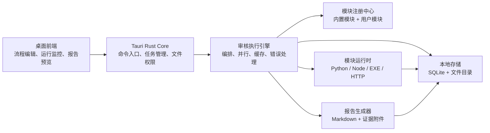
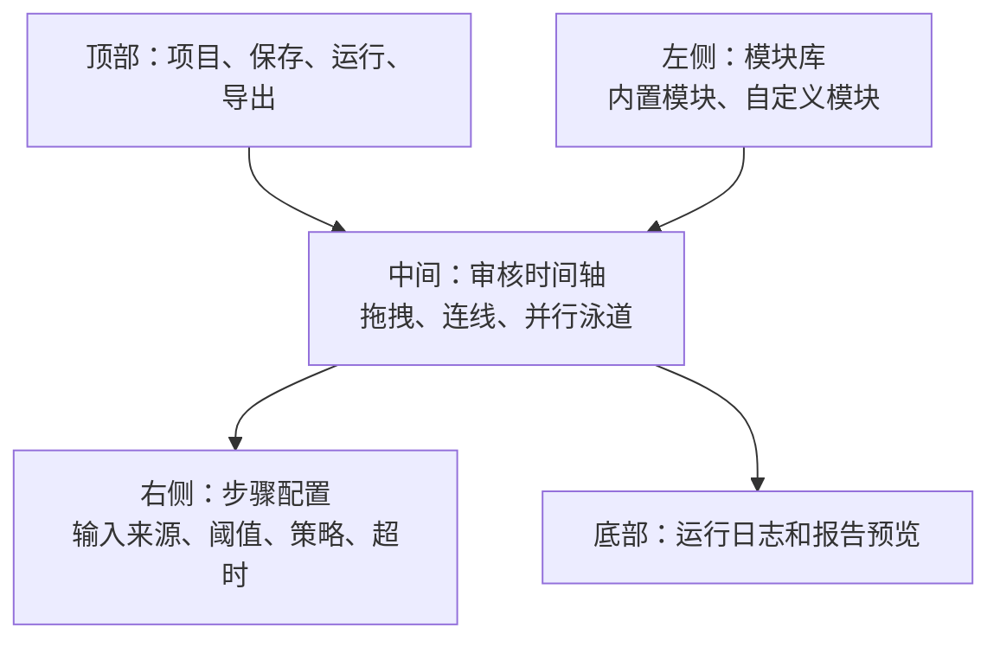
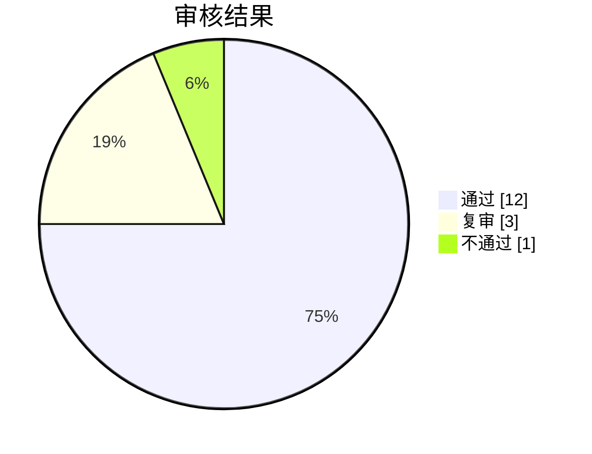
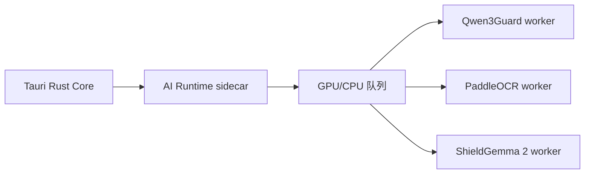
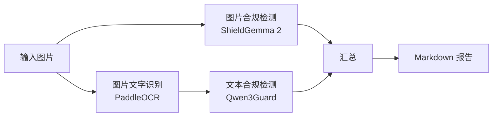
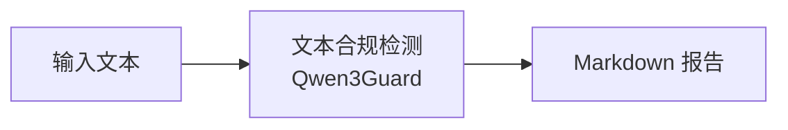
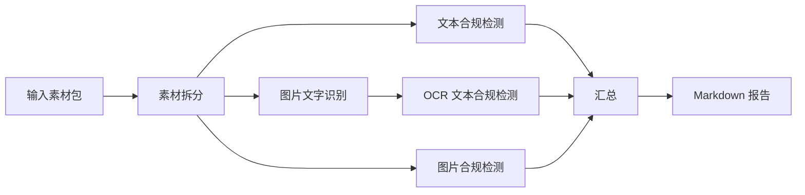

# UGCAudit 系统设计

本文基于当前仓库状态设计：现在项目是一个最小 Tauri 2 桌面应用，前端还是静态页面，Rust 侧只启动窗口。后续应保留 Tauri 作为桌面壳，把真正的审核链能力拆成“可视化编排 + 执行引擎 + 模块运行时 + 报告系统”四块。

## 目标

UGCAudit 要解决的是：用户把文本、图片或混合素材丢进桌面应用，通过可视化方式配置审核流程，流程里的每一步可以串行，也可以并行。每一步都是一个审核模块，模块可以是内置能力，也可以是用户自己开发的扩展模块。每个模块产出结构化审核数据，同时给最终 Markdown 报告贡献一段结论。

核心要求：

- 桌面端本地运行，优先支持离线或私有化部署。
- 流程可视化，用户能拖模块、连流程、设置并行分支。
- 模块之间能传数据，例如图片 OCR 结果交给文本审核模块。
- 内置三个模块：文本合规检测、图片文字识别、图片合规检测。
- 用户能开发自定义审核模块，并拖到流程里使用。
- 每次审核都保留完整证据、过程日志、模块输出和最终 Markdown 报告。

## 推荐技术选型

### 桌面壳

继续使用 Tauri 2。前端负责界面，Rust 负责本地文件、任务调度、进程管理和安全边界。

Tauri 2 支持前端调用 Rust command，也支持把外部二进制作为 sidecar 打包和运行。这个能力适合把 PaddleOCR、ShieldGemma 2、Qwen3Guard 这类 Python/模型服务拆成独立进程，由桌面壳统一启动和管理。

参考：

- Tauri 前端调用 Rust command: https://v2.tauri.app/zh-cn/develop/calling-rust/
- Tauri sidecar: https://v2.tauri.app/zh-cn/develop/sidecar/

### 前端框架

当前前端是纯 HTML/JS。真实产品建议迁到：

- React + Vite
- TypeScript
- React Flow / xyflow 做流程编辑器
- Zustand 或 Jotai 管理编辑器状态

React Flow 适合节点、连线、拖拽和流程图编辑。xyflow 官方说明 React Flow 是 MIT 许可，适合商业项目使用。它本质是节点图，不是传统时间轴，但可以通过左到右布局、泳道和阶段分组做成“时间轴式审核流”。

参考：

- React Flow 概念: https://reactflow.dev/learn/concepts/terms-and-definitions
- React Flow 拖拽示例: https://reactflow.dev/examples/interaction/drag-and-drop
- xyflow 开源说明: https://xyflow.com/open-source

### 内置模型模块

1. 文本合规检测：默认用 Qwen3Guard-Gen。
   - Qwen3Guard 是 Qwen 团队的多语言安全审核模型，提供 0.6B、4B、8B 等尺寸，输出 Safe / Controversial / Unsafe 和风险类别。
   - 桌面端默认建议先支持 `Qwen3Guard-Gen-0.6B`，低配置机器更容易跑；需要更高准确率时切到 4B 或 8B。
   - 如果主要审核中文内容，可以把 Xiangxin-Guardrails-Text 作为可选增强模块，它面向中文内容合规，Apache 2.0，可私有化部署。

2. 图片文字识别：用 PaddleOCR。
   - 默认用 PP-OCRv5 mobile 配置，速度和资源占用更适合桌面端。
   - 高准确率模式可以提供 server 配置。
   - PaddleOCR 也已经有 PaddleOCR.js，可以作为未来“无 Python 运行时”的方向，但首版更建议使用 Python sidecar，稳定性和模型生态更成熟。

3. 图片合规检测：用 ShieldGemma 2。
   - ShieldGemma 2 是 Google 的 4B 图像安全分类模型，面向色情、危险内容、暴力/血腥等策略输出安全标签。
   - 它支持自定义策略，但模型对策略描述敏感，所以策略文本必须版本化，不要让用户随意改核心模板后仍当作同一套审核标准。

参考：

- Qwen3Guard: https://github.com/QwenLM/Qwen3Guard
- Xiangxin-Guardrails-Text: https://www.modelscope.cn/models/xiangxinai/Xiangxin-Guardrails-Text
- PaddleOCR: https://github.com/PaddlePaddle/PaddleOCR
- PP-OCRv5 文档: https://www.paddleocr.ai/v3.3.0/version3.x/algorithm/PP-OCRv5/PP-OCRv5.html
- ShieldGemma 2 model card: https://huggingface.co/google/shieldgemma-2-4b-it
- Google ShieldGemma 文档: https://ai.google.dev/gemma/docs/shieldgemma

## 总体架构



职责划分：

- 前端：只管展示、编辑、操作，不直接跑模型。
- Tauri Rust Core：统一对前端开放命令，管理本地文件、运行任务、启动 sidecar。
- 审核执行引擎：把流程图转换成可执行计划，处理串行、并行、失败、取消、缓存。
- 模块注册中心：读取内置模块和用户模块的描述文件，告诉前端有哪些模块能拖。
- 模块运行时：真正执行文本检测、OCR、图片安全检测和用户自定义模块。
- 本地存储：保存项目、流程模板、运行记录、输出数据、日志和报告。
- 报告生成器：统一生成最终 Markdown，避免并行模块同时写文件造成冲突。

## 核心对象

### Project

一个审核项目，包含流程模板、模块配置和历史运行记录。

### Asset

待审核素材。可以是：

- 文本
- 单张图片
- 多张图片
- 文件夹
- 后续可扩展为视频、音频、压缩包

### Flow

用户配置的审核流。它在界面上像时间轴，但内部存成有向无环图，方便表达串行和并行。

### Step

流程里的一个审核步骤。每个 Step 绑定一个 Module，并保存该模块的配置。

### Module

一个可运行的审核模块。模块可以是内置模块，也可以是用户开发的模块。

### Run

一次审核执行。Run 必须保存当时使用的流程快照、模块版本、输入素材和所有输出，避免以后流程变了导致历史结果无法解释。

### Artifact

模块产生的文件证据，例如 OCR 标注图、原始 JSON、截图、裁剪图、模型输出日志。

### Report

最终 Markdown 报告。报告由执行引擎统一写入，模块只返回自己的报告片段。

## 流程编辑器设计

界面建议分成四块：



推荐交互：

- 左侧模块拖到中间时间轴。
- 左到右表示执行顺序。
- 上下泳道表示并行分支。
- 连线表示数据依赖。
- 并行分支结束处放一个 Join 节点，设置“全部完成再继续”或“任一命中即停止”。
- 每个步骤卡片显示运行状态：等待、运行中、通过、需复审、拒绝、失败。
- 点击步骤，在右侧配置输入、阈值、模型、策略和输出映射。

不要把“时间轴”直接存成数组。数组只能表达简单串行。建议存成节点和边：

```json
{
  "id": "flow.default.image-audit",
  "name": "图片 UGC 默认审核",
  "version": 1,
  "nodes": [
    {
      "id": "image_ocr",
      "moduleId": "builtin.paddleocr",
      "position": { "x": 160, "y": 120 },
      "config": {
        "profile": "mobile",
        "language": "ch"
      }
    },
    {
      "id": "image_safety",
      "moduleId": "builtin.shieldgemma2",
      "position": { "x": 160, "y": 280 },
      "config": {
        "policies": ["sexual", "violence_gore", "dangerous"]
      }
    },
    {
      "id": "text_safety",
      "moduleId": "builtin.qwen3guard",
      "position": { "x": 460, "y": 120 },
      "config": {
        "modelSize": "0.6b",
        "input": "$steps.image_ocr.outputs.fullText"
      }
    }
  ],
  "edges": [
    { "from": "image_ocr", "to": "text_safety" },
    { "from": "image_ocr", "to": "final_report" },
    { "from": "image_safety", "to": "final_report" },
    { "from": "text_safety", "to": "final_report" }
  ]
}
```

## 执行模型

执行引擎按以下步骤运行：

1. 校验流程。
   - 不能有环。
   - 每个模块输入必须能找到来源。
   - 并行分支必须有明确汇合规则。
   - 自定义模块的权限、版本和运行入口必须合法。

2. 创建运行目录。
   - 保存输入素材副本或引用。
   - 保存流程快照。
   - 保存模块版本快照。

3. 计算可执行步骤。
   - 没有依赖的步骤先运行。
   - 依赖完成后，下游步骤自动进入等待队列。
   - 同一批可执行步骤可以并行。
   - 数据线如果来自真实模块输出，也会自动变成等待关系，不要求用户额外把模块顺序线直接连到数据节点。
   - 第一版并发上限固定为 2，避免默认流程同时占用过多本机资源。

4. 执行模块。
   - 给模块传入统一 JSON。
   - 模块输出统一 JSON。
   - 大文件通过文件路径或 Artifact ID 传递，不直接塞进 JSON。
   - 模块通过进度文件追加 JSON 行，客户端实时读取并推给前端。
   - 用户中断时客户端先创建中断标记文件，3 秒内模块未退出则强制停止进程。

5. 汇总结果。
   - 每个步骤输出结构化结果。
   - 报告生成器按流程顺序写入 Markdown。
   - 如果某一步命中拒绝规则，可以根据流程配置停止后续步骤。

6. 保存完整运行结果。
   - `run.json`
   - `flow.snapshot.json`
   - `steps/{stepId}/output.json`
   - `steps/{stepId}/artifacts/*`
   - `logs.jsonl`
   - `report.md`

并行写报告的处理方式：

模块不要直接写最终 Markdown 文件。模块返回 `reportSection`，执行引擎是唯一写报告的人。这样用户理解上仍然是“模块向总报告写入结论”，但实现上不会发生并行写入冲突。

## 运行目录结构

建议每次审核都生成独立目录：

```text
app-data/
  projects/
    {projectId}/
      flows/
        {flowId}.json
      runs/
        {runId}/
          input/
          flow.snapshot.json
          run.json
          logs.jsonl
          report.md
          steps/
            image_ocr/
              input.json
              output.json
              artifacts/
                ocr-boxes.png
            image_safety/
              input.json
              output.json
            text_safety/
              input.json
              output.json
```

SQLite 只存索引和摘要，文件系统存大文件和完整证据。

SQLite 主要表：

- `projects`
- `flows`
- `modules`
- `runs`
- `step_runs`
- `artifacts`
- `settings`

## 模块协议

所有模块，无论内置还是自定义，都使用同一套协议。

### module.json

模块目录必须包含 `module.json`：

```json
{
  "id": "builtin.paddleocr",
  "name": "图片文字识别",
  "version": "1.0.0",
  "kind": "image_ocr",
  "runtime": {
    "type": "python",
    "entry": "main.py"
  },
  "inputs": {
    "asset": ["image"]
  },
  "outputs": {
    "fullText": "string",
    "lines": "array",
    "boxes": "array"
  },
  "configSchema": {
    "type": "object",
    "properties": {
      "profile": {
        "type": "string",
        "enum": ["mobile", "server"]
      },
      "language": {
        "type": "string"
      }
    },
    "required": ["profile"]
  },
  "permissions": {
    "fileRead": true,
    "fileWrite": true,
    "network": false,
    "gpu": "optional"
  },
  "timeoutSeconds": 120
}
```

### 模块输入

执行引擎传给模块的输入建议统一为：

```json
{
  "runId": "run_20260530_001",
  "stepId": "image_ocr",
  "moduleId": "builtin.paddleocr",
  "workDir": "D:/.../runs/run_20260530_001/steps/image_ocr",
  "asset": {
    "type": "image",
    "path": "D:/.../input/image.png"
  },
  "config": {
    "profile": "mobile",
    "language": "ch"
  },
  "previous": {
    "image_safety": {
      "verdict": "pass",
      "labels": []
    }
  }
}
```

### 模块输出

模块输出必须是 JSON：

```json
{
  "status": "success",
  "verdict": "review",
  "confidence": 0.91,
  "labels": [
    {
      "name": "sexual_content",
      "risk": "medium",
      "score": 0.72
    }
  ],
  "outputs": {
    "fullText": "识别出的文字",
    "lines": []
  },
  "artifacts": [
    {
      "name": "OCR 标注图",
      "path": "artifacts/ocr-boxes.png",
      "type": "image"
    }
  ],
  "reportSection": "## 图片文字识别\n\n识别到 12 行文字，整体置信度 0.91。\n",
  "metrics": {
    "durationMs": 1420
  }
}
```

`verdict` 建议固定为：

- `pass`: 通过
- `review`: 需要人工复审
- `reject`: 不通过
- `error`: 执行失败

## 内置模块设计

### 1. 文本合规检测模块

模块 ID：`builtin.qwen3guard`

默认模型：`Qwen3Guard-Gen-0.6B`

输入：

- 用户直接提交的文本
- OCR 模块输出的文字
- 上游模块整理出的文本字段

输出：

- 总体结论：通过、复审、不通过
- 风险级别：Safe、Controversial、Unsafe
- 风险类别：暴力、违法、色情、隐私、自伤、政治敏感、版权、越狱等
- 证据片段：命中的原文片段
- 给报告的结论段落

阈值策略：

- Safe -> pass
- Controversial -> review
- Unsafe -> reject
- 用户可以为不同类别单独设置更严格或更宽松的处理方式

中文内容优先场景：

- 首版可以先接 Qwen3Guard。
- 如果发现中文合规场景不足，再加 `builtin.xiangxin_text_guard` 作为增强模块。
- 两者可以并联，任一模块命中高风险就进入复审或拒绝。

### 2. 图片文字识别模块

模块 ID：`builtin.paddleocr`

默认模型：PaddleOCR PP-OCRv5 mobile

输入：

- 单张图片
- 多张图片
- 图片列表

输出：

- 完整文本 `fullText`
- 每一行文字、置信度、位置框
- 标注过文字框的证据图
- 低置信度文字列表

配置：

- 模式：mobile / server
- 语言：中文、英文、多语言
- 最低置信度
- 是否输出标注图

和下游配合：

- OCR 结果可以直接接到文本合规检测。
- OCR 低置信度时，可以让文本合规模块降权，或者直接进入人工复审。

### 3. 图片合规检测模块

模块 ID：`builtin.shieldgemma2`

默认模型：`google/shieldgemma-2-4b-it`

输入：

- 图片
- 图片列表

输出：

- 色情风险
- 暴力/血腥风险
- 危险内容风险
- 每个策略的标签和置信度
- 给报告的结论段落

配置：

- 检测策略：sexual、violence_gore、dangerous
- 自定义策略模板
- 阈值
- GPU / CPU 运行方式

注意：

- ShieldGemma 2 体积和资源占用较高，不建议默认塞进安装包。
- 推荐做模型管理器：首次使用时下载，或者让用户选择本地模型目录。
- 模型许可和使用条款要在模型管理器里明确展示并记录用户确认。

## 自定义模块机制

用户自定义模块有两种形态：

1. 命令行模块
   - Python、Node、Rust、Go、任意 exe 都可以。
   - 接收 `input.json` 路径。
   - 输出 `output.json`。

2. 本地 HTTP 模块
   - 用户自己启动服务。
   - UGCAudit 通过 HTTP 调用。
   - 适合重模型或团队共享模型服务。

首版建议先支持命令行模块，因为最好落地、最好调试。

自定义模块目录：

```text
modules/
  my-company-logo-check/
    module.json
    main.py
    requirements.txt
    README.md
```

模块安装流程：

1. 用户选择模块目录。
2. 应用读取 `module.json`。
3. 校验 ID、版本、入口、输入输出、权限。
4. 放入模块库。
5. 用户拖到流程里使用。

权限设计：

- 默认不允许网络。
- 默认只能访问本次运行目录和输入素材。
- 需要写文件时只能写自己的 step 工作目录。
- 需要 GPU、网络、外部目录时必须在模块配置中显式声明。

注意：桌面端运行用户自定义代码本质上有风险。应用应该把模块标成“受信任”和“未受信任”，并在运行前提示权限。

## 数据传递

当前流程已经拆成两类连线：

- 顺序连线：只决定步骤什么时候运行。一个步骤有多个顺序输入时，必须等这些上游步骤都完成后才运行。
- 数据连线：只决定传什么数据。数据口只能连接同类型数据口，图片集合不能接到文本输入，顺序口也不能接数据口。

当前内置图片集合、文本集合和文件夹三类数据：

```json
{
  "dataType": "imageCollection",
  "items": [
    {
      "path": "D:/project/images/a.png",
      "name": "a.png",
      "extension": "png",
      "relativePath": "images/a.png",
      "sourceAssetId": "asset_1",
      "sourceAssetName": "project"
    }
  ]
}
```

```json
{
  "dataType": "textCollection",
  "items": [
    {
      "sourceType": "file",
      "path": "D:/project/texts/a.txt",
      "name": "a.txt",
      "relativePath": "texts/a.txt",
      "text": "待检测文本"
    }
  ]
}
```

```json
{
  "dataType": "folder",
  "path": "D:/project/Assets",
  "name": "Assets",
  "relativePath": "Assets"
}
```

内置数据节点：

- 待测项目中所有图片
- 待测项目中所有文本
- 产物文件夹中所有图片
- 产物文件夹中所有文本
- 待测项目相对路径下所有图片
- 待测项目相对路径下所有文本
- 待审核文件夹
- 待审核文件夹下相对路径文件夹
- 产物文件夹
- 待产物文件夹下相对路径文件夹
- 将两个图片集合合并
- 将两个文本集合合并

文件夹数据节点输出单个文件夹，不输出集合。相对路径文件夹节点会把 `relativePath` 解析成一个真实存在的文件夹。

数据节点在组件库中按“待测项目”“产物文件夹”“数据处理”分组展示。产物文件夹节点会在模块运行前读取本次审核产物目录里的现有文件，因此可以读取前序模块已经写出的结果。

三个预置模块的数据口：

- 图片文字识别：输入图片集合，输出文本集合。
- 文本合规检测：输入文本集合。
- 图片合规检测：输入图片集合。
- 文件夹处理模块：输入文件夹。

执行模块时，客户端会把数据口结果放在 `inputs` 中。同时为了兼容旧模块脚本，仍然会生成旧字段 `files` 和 `previous`，但内容只来自当前节点实际连上的数据。

模块之间通过结构化输出传递数据。

示例：

- `$asset.path`: 当前素材路径
- `$steps.image_ocr.outputs.fullText`: OCR 全文
- `$steps.image_ocr.outputs.lines`: OCR 行列表
- `$steps.image_safety.verdict`: 图片合规结论
- `$steps.text_safety.labels`: 文本风险标签

前端配置时不要让用户手写复杂表达式。右侧配置面板应该提供下拉选择：

- 输入来源：原始文本 / OCR 全文 / 某模块输出
- 字段：fullText / labels / verdict / artifacts

内部再保存成路径表达式。

## 报告设计

最终 Markdown 建议固定结构：

```markdown
# UGC 审核报告

## 总结

- 最终结论：需要人工复审
- 主要原因：图片文字命中文本风险；图片本身未命中高风险
- 审核时间：2026-05-30 14:20:12

## 输入素材

- 类型：图片
- 文件：xxx.png

## 流程结果

| 步骤 | 结论 | 置信度 | 耗时 |
| --- | --- | --- | --- |
| 图片文字识别 | 通过 | 0.93 | 1.4s |
| 图片合规检测 | 通过 | 0.96 | 3.2s |
| 文本合规检测 | 复审 | 0.88 | 1.1s |

## 模块结论

### 图片文字识别

...

### 图片合规检测

...

### 文本合规检测

...

## 证据附件

- OCR 标注图：steps/image_ocr/artifacts/ocr-boxes.png
- 原始模型输出：steps/text_safety/output.json
```

报告页会按富文本预览这份 Markdown。模块的 `reportSection` 仍然返回字符串，不需要改成结构化对象。当前预览支持：

- 普通 Markdown：标题、段落、表格、列表、任务列表、链接、图片、代码块。
- 安全 HTML：可以用于折叠说明、简单布局、表格等展示内容；脚本、内嵌页面、表单和事件属性不会生效。
- Mermaid 图示：在 `mermaid` 代码块里写流程图、饼图等图示。

示例：

````markdown
### 审核结果分布



<details>
  <summary>查看补充说明</summary>
  <p>这里可以放安全的 HTML 内容。</p>
</details>
````

最终结论合并规则：

- 任一步 `reject` -> 总结论 `reject`
- 否则任一步 `review` -> 总结论 `review`
- 全部 `pass` -> 总结论 `pass`
- 任一步 `error` -> 总结论 `error` 或 `review`，由流程配置决定

## 模型运行方式

建议做一个独立的 AI Runtime。



为什么需要 Runtime：

- Python 生态更适合跑 PaddleOCR 和 Transformers。
- 大模型启动慢，需要复用进程，不要每个步骤都重新加载模型。
- GPU 同时跑多个模型容易爆显存，需要队列控制。
- Rust Core 保持轻量，只负责调度和文件管理。

Runtime 对外提供两种模式：

1. CLI 模式：适合首版，简单稳定。
2. 长驻服务模式：适合后续性能优化，模型只加载一次。

首版可以先 CLI，等流程跑通后再改成长驻服务。

## 审核方案和流水线入口

客户端支持把流程保存成 `.ugcaudit` 审核方案文件。方案只保存流程节点、连线和模块参数，不保存待审文件夹。

新建方案默认保存到程序根目录下的 `Schemes` 文件夹。前端顶部提供方案列表，直接枚举这个文件夹里的 `.ugcaudit` 文件，用户可以从列表快速切换；“加载”按钮仍保留，用于打开其他位置的方案文件。

同一个 `ugc-audit.exe` 带 `run` 参数时进入无窗口 CLI 模式：

```powershell
ugc-audit.exe run --scheme "D:\AuditSchemes\image.ugcaudit" --input "D:\UGCProject" --task-name "每日图片审核" --output "D:\AuditRuns\run-001"
```

CLI 退出码用于流水线判断：`0` 表示通过，`2` 表示需要复审或不通过，`1` 表示运行失败。`--output` 表示本次产物目录；不传时使用客户端默认产物路径并自动创建 `任务名称-任务ID` 文件夹。产物目录内会写出 `run.json`、`report.md` 和 `cli-result.json`。

## 前端页面

建议首版包含这些页面：

- 项目首页：项目列表、最近运行、创建项目。
- 流程编辑：模块库、时间轴、配置面板、校验结果。
- 运行页面：选择素材、开始审核、实时状态、取消任务。
- 报告页面：Markdown 预览、导出、打开证据文件。
- 模块管理：内置模块状态、自定义模块安装、模型下载状态。
- 设置：模型目录、缓存目录、GPU/CPU、默认阈值。

## Tauri 命令接口

前端只通过这些命令和 Rust Core 通信：

- `list_modules`
- `install_module`
- `validate_flow`
- `save_flow`
- `load_flow`
- `start_run`
- `cancel_run`
- `get_run_status`
- `open_report`
- `reveal_artifact`
- `download_model`
- `get_model_status`

运行状态通过事件推给前端：

- `run_started`
- `step_started`
- `step_progress`
- `step_completed`
- `step_failed`
- `step_cancelled`
- `report_updated`
- `run_completed`
- `run_failed`
- `run_cancelled`

运行界面使用运行开始时的流程快照，只展示状态，不允许拖拽、连线、删除或修改参数。节点显示进度条和状态文案；正在传递或等待的连线显示从来源到目标移动的小圆点。

模块进度协议：

```json
{
  "progress": 0.5,
  "message": "已处理 3/6",
  "processed": 3,
  "total": 6
}
```

客户端会把进度文件路径同时写入输入 JSON 的 `progressPath` 和环境变量 `UGCAUDIT_PROGRESS_FILE`。中断标记路径同时写入 `cancelPath` 和 `UGCAUDIT_CANCEL_FILE`。模块应在循环中检查中断标记，收到后写出 `status: "cancelled"` 的结果并退出；旧模块不支持该协议时仍可运行，客户端会用兜底状态显示并在必要时停止进程。

## 缓存和复跑

缓存规则：

- 同一个素材、同一个模块版本、同一个配置，输出可以复用。
- 缓存命中时仍要写入本次报告，但标记为来自缓存。
- 用户可以强制重新运行某一步或整个流程。

缓存 key：

```text
hash(asset bytes + module id + module version + config + model version)
```

## 错误处理

每个 Step 都要有失败策略：

- 停止整个审核
- 跳过当前步骤
- 标记为人工复审并继续
- 使用备用模块

推荐默认：

- OCR 失败：review，继续跑图片合规检测。
- 图片合规检测失败：review，继续跑 OCR 和文本检测。
- 文本检测失败：review。
- 自定义模块失败：按用户配置处理。

## 安全和合规

必须提前做的事：

- 模型许可确认：尤其是 ShieldGemma / Gemma 系列，需要展示使用条款。
- 本地数据不默认上传。
- 自定义模块默认无网络权限。
- 运行日志里不要泄露过多敏感文本，完整敏感内容只放本地报告和输出文件。
- 支持一键清理缓存和历史运行。
- 报告导出时提醒可能包含原始违规内容。

## 开发落地顺序

### 第一阶段：流程编辑骨架

- 迁移到 React + TypeScript + Vite。
- 接入 React Flow。
- 做模块库、拖拽、连线、保存流程。
- 支持串行和并行的流程校验。
- 先用假模块跑通状态流转和报告生成。

### 第二阶段：执行引擎

- Rust Core 增加运行目录、日志、报告生成。
- 实现 `start_run`、`cancel_run`、事件推送。
- 实现模块输入输出协议。
- 支持命令行自定义模块。

### 第三阶段：内置模块

- 接 PaddleOCR。
- 接 Qwen3Guard。
- 接 ShieldGemma 2。
- 做模型管理器和首次运行检查。

### 第四阶段：产品化

- 模块市场/模块导入导出。
- 流程模板库。
- 批量审核。
- 结果筛选和人工复审队列。
- 缓存、复跑、性能统计。

## 首版默认流程

图片 UGC 推荐默认流程：



这个流程里，OCR 和图片合规检测可以并行。OCR 完成后，把识别出的文字交给文本合规检测。最后统一汇总。

文本 UGC 推荐默认流程：



混合 UGC 推荐默认流程：



## 当前仓库建议改造点

当前仓库很适合作为壳继续扩展，但离目标系统还差这些基础改造：

1. 前端从静态页面迁到 React + Vite + TypeScript。
2. 增加 `src-tauri` 侧 command。
3. 增加本地数据目录和运行目录管理。
4. 增加 `modules/` 和 `models/` 目录约定。
5. 增加执行引擎和报告生成器。
6. 增加模型 sidecar 打包或模型管理器。

首个可交付版本不用一次接真模型。应该先用假模块把流程编辑、执行、报告和模块协议跑通，再替换成真实 PaddleOCR / Qwen3Guard / ShieldGemma 2。
